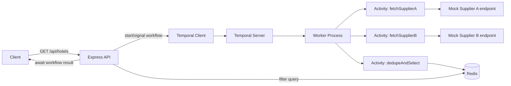

# Hotel Offer Orchestrator — Design Document

## 1. Overview

The Hotel Offer Orchestrator aggregates hotel listings from two mock suppliers, deduplicates
them by hotel name, picks the cheaper offer per hotel, caches the result in Redis, and exposes
a filterable API. Temporal orchestrates the fan-out/fan-in comparison logic so the workflow is
durable, retryable, and observable independent of the HTTP request lifecycle.

**Stack:** Node.js + TypeScript, Express, Temporal.io, Redis, Docker Compose.

---

## 2. Goals / Non-Goals

**Goals**
- Correctly aggregate + dedupe hotels from two suppliers by name, cheapest wins.
- Orchestrate via Temporal (parallel activity calls, retries, timeouts, visibility).
- Cache deduped results in Redis; filter by price range using Redis itself (not in-app filtering).
- Be resilient to a single supplier being down.
- Ship containerized, testable, documented.

**Non-Goals**
- Real supplier integrations (mocked in-process).
- Auth/user management (not in scope; noted as a future extension).
- Multi-region deployment.

---

## 3. High-Level Architecture



**Why Temporal here:** the "call two suppliers in parallel, merge, dedupe" logic is a workflow,
not just a promise chain — Temporal buys us:
- Automatic retries per activity (e.g. Supplier B timeout) without hand-rolled retry logic.
- Independent timeouts per supplier call so one slow supplier doesn't block the other.
- Full execution history/visibility in Temporal Web UI for debugging.
- Durability — if the worker crashes mid-comparison, the workflow resumes instead of losing state.

---

## 4. Request Flow

### `GET /api/hotels?city=delhi[&minPrice=][&maxPrice=]`

1. Express validates `city` (required) and optional `minPrice`/`maxPrice` (numeric, `min <= max`).
2. API starts a Temporal workflow `HotelAggregationWorkflow` with `workflowId = "hotel-agg-{city}"`
   using `WORKFLOW_ID_REUSE_POLICY = ALLOW_DUPLICATE` (so repeated calls re-run cleanly) — or,
   for high-traffic cities, a short dedupe window using `REJECT_DUPLICATE` + catching the
   "already running" error and attaching to the existing workflow (avoids thundering herd).
3. Workflow executes:
   - `fetchSupplierA(city)` and `fetchSupplierB(city)` in **parallel** via `Promise.all` over
     `proxyActivities` calls — each with its own retry policy and timeout.
   - If one supplier activity exhausts retries, the workflow **does not fail** — it treats that
     supplier's result as an empty list and logs a partial-failure marker (see §6 error handling).
   - `dedupeAndSelect(listA, listB)` activity merges by `name` (case-insensitive, trimmed):
     - Hotel in both → keep the cheaper `price`; tie → prefer the one with lower `commissionPct`
       (documented, deterministic tiebreak), else Supplier A by convention.
     - Hotel in only one → keep as-is.
   - `cacheToRedis(city, dedupedList)` writes the result (see §5 for Redis schema).
4. API awaits the workflow result (`handle.result()`), typically <1s given short activity timeouts.
5. If `minPrice`/`maxPrice` supplied, API calls a Redis range-query helper (not a JS `.filter()`)
   against the cached sorted set (§5) and returns the filtered subset.
6. Response: JSON array matching the spec's shape (`name`, `price`, `supplier`, `commissionPct`).

### `GET /health`
Calls both mock supplier endpoints with a short timeout (e.g. 1.5s) in parallel and reports:
```json
{
  "status": "ok",
  "suppliers": {
    "supplierA": { "status": "up", "latencyMs": 42 },
    "supplierB": { "status": "down", "error": "timeout" }
  },
  "redis": "up",
  "temporal": "up"
}
```
Overall `status` is `"degraded"` if any supplier is down, `"down"` if Redis/Temporal
connections are unavailable, `"ok"` otherwise.

### Mock supplier endpoints
`GET /supplierA/hotels?city=delhi`, `GET /supplierB/hotels?city=delhi` — return static/seeded
JSON per the spec, with a deliberate overlap set (e.g. 3–4 shared hotel names with different
prices) and some unique-per-supplier hotels. Support a `?simulateDown=true` query flag or an
env-var toggle for Postman's "supplier down" test case.

Supply an outage-simulation mechanism at two levels: a per-request `?simulateDown=true`
query param on either mock endpoint (forces that single call to return a `5xx`, no
restart needed), and a `SIMULATE_SUPPLIER_DOWN` environment variable (`none` | `a` | `b`)
read by the mock endpoints at the server level, so the *whole* stack — including the
Temporal workflow's own calls to these endpoints — treats a supplier as down until the
containers are restarted without it. Only the env-var form produces genuine end-to-end
degradation through `/api/hotels` and `/health`; the query-param form is scoped to
whichever single request sets it. This variable exists purely to support integration
tests and Postman demos and should never be set in a production deployment.

---

## 5. Data Model & Redis Schema

Store two structures per city so range filtering happens **inside Redis**, not in app code:

1. **Hash** — full offer object per hotel (for retrieval by name):
   `hotels:{city}:{hotelNameSlug}` → JSON string `{name, price, supplier, commissionPct}`
   TTL: e.g. 300s (configurable), refreshed each time the workflow completes.

2. **Sorted Set** — price index for range queries:
   `hotels:{city}:by_price` → member = `hotelNameSlug`, score = `price`
   Filtering uses `ZRANGEBYSCORE hotels:{city}:by_price minPrice maxPrice`, then `MGET`/`HGET`
   on the hash keys to build the response. This is the "implement price filtering inside Redis"
   requirement — Redis does the range scan, not `Array.prototype.filter`.

   Set both keys with the same TTL inside a `MULTI`/pipeline so they can't desync.

**Cache invalidation:** on every successful workflow run for a city, `DEL` the old sorted set
and hash keys for that city before writing the new ones (avoid stale hotels lingering after a
supplier removes one).

---

## 6. Error Handling & Logging

**Activities**
- Each supplier-fetch activity wraps its HTTP call with a Temporal `RetryPolicy`
  (`maximumAttempts: 3`, exponential backoff, `startToCloseTimeout: 3s`).
- On exhausting retries, the activity returns `{ supplier: 'A', hotels: [], error: 'unreachable' }`
  rather than throwing — this lets the workflow degrade gracefully (spec: "if only one supplier
  returns a hotel, select that one" implicitly covers "supplier down" as a subset).
- All activity errors are logged with structured fields: `{ workflowId, activity, city, attempt, error }`.

**Workflow**
- Wrap the parallel calls so a single activity failure (after retries) doesn't fail the whole
  workflow — use `Promise.allSettled` semantics via try/catch per proxied activity call.
- Log workflow-level milestones (`started`, `suppliers fetched`, `deduped N hotels`, `cached`)
  using Temporal's `workflow.log` (visible in Temporal UI + shipped to stdout via worker logger).

**API layer**
- Centralized Express error-handling middleware → consistent error JSON shape:
  `{ error: { code, message } }`.
- Input validation errors → `400`.
- Workflow timeout (e.g. both suppliers down and Temporal itself can't complete in N seconds) → `503`
  with a clear message, not a raw stack trace.
- Structured request logging (method, path, status, latency, correlation id) via `pino` or `winston`.
- Never leak internal errors/stack traces to the client in production mode (`NODE_ENV=production`).

---

## 7. Security Checks

Even for an assessment-scale service, apply baseline hardening:

- **Input validation & sanitization** — `city`, `minPrice`, `maxPrice` validated with a schema
  library (`zod`) at the route boundary; reject non-numeric price params, negative values,
  `minPrice > maxPrice`, and unreasonably long `city` strings (cap length, allow-list charset
  to avoid injection into Redis keys — slugify city before using it as a key segment).
- **No dynamic Redis key construction from raw user input** — always slugify/whitelist first to
  prevent key-injection or unbounded key sprawl.
- **Rate limiting** — `express-rate-limit` per IP on `/api/hotels` to prevent abuse triggering
  repeated Temporal workflow starts.
- **Helmet** — standard secure headers (`helmet` middleware).
- **CORS** — explicit allow-list origin config, not `*`, if this is ever exposed beyond localhost.
- **Secrets/config** — Redis/Temporal connection strings via env vars (`.env`, not committed);
  provide `.env.example`.
- **Dependency hygiene** — `npm audit` in CI; pin versions in `package-lock.json`.
- **No sensitive data logged** — logs contain city/price/workflowId, never raw request bodies
  with anything beyond these fields.
- **Docker hardening** — run the Node process as a non-root user in the image; use a slim base
  image (`node:20-alpine`); multi-stage build so dev dependencies aren't shipped.
- **Timeouts everywhere** — HTTP client (axios) timeouts on supplier calls, Temporal
  `startToCloseTimeout`, Express server `timeout`, Redis connection timeout — prevents resource
  exhaustion from a hanging dependency.

---

## 8. Testing Strategy

### 8.1 Unit tests (Jest)
- `dedupeAndSelect()` — the core business logic — pure function tests:
  - Hotel in both suppliers, A cheaper → A wins.
  - Hotel in both, B cheaper → B wins.
  - Tie on price → deterministic tiebreak (documented rule) is applied.
  - Hotel only in A / only in B → passthrough.
  - Case/whitespace differences in names still dedupe (`"Holtin "` vs `"holtin"`).
  - Empty list from one supplier → other supplier's list returned unchanged.
- Redis helper functions (price-range query, key slugification) — tested against a mocked or
  `ioredis-mock` client.
- Request validation schemas (`zod`) — valid/invalid `minPrice`/`maxPrice`/`city` combinations.

### 8.2 Activity tests
- Use Temporal's `TestWorkflowEnvironment` / mocked activity context to test `fetchSupplierA/B`
  activities against a mocked HTTP layer (`nock` or `msw`), including timeout and retry behavior.

### 8.3 Workflow tests
- Temporal's `@temporalio/testing` package to run `HotelAggregationWorkflow` in a test
  environment with mocked activities, asserting:
  - Both suppliers succeed → correct merged output.
  - One supplier activity fails all retries → workflow still completes with the other supplier's data.
  - Both suppliers fail → workflow completes with an empty list + logs the degraded state (not a hard failure).

### 8.4 Integration tests
- Spin up the full `docker-compose` stack (API + worker + Temporal + Redis) in CI and run
  supertest-based HTTP tests against `/api/hotels`, `/health`, and the mock supplier endpoints.

### 8.5 Manual/API testing — Postman
Postman collection (`hotel-orchestrator.postman_collection.json`) with:
1. **Valid city with overlap** — `GET /api/hotels?city=delhi` → assert 200, array shape matches
   spec, overlapping hotel appears once with the cheaper price.
2. **Valid city + price filter** — `GET /api/hotels?city=delhi&minPrice=4000&maxPrice=6000` →
   assert all returned prices fall in range.
3. **City with no results** — `GET /api/hotels?city=atlantis` → assert 200 + empty array (not 404,
   since "no hotels" isn't an error condition).
4. **Invalid price params** — `minPrice > maxPrice` or non-numeric → assert 400 with error body.
5. **Simulate supplier down** — hit mock supplier with `?simulateDown=true` (or set an env toggle
   and restart), then call `/api/hotels?city=delhi` → assert 200 with only the healthy supplier's
   hotels returned, not a 500.
6. **Health check** — `GET /health` → assert both suppliers reported, with one flipped to `"down"`
   in the simulated-outage scenario.

Postman test scripts use `pm.test()` assertions on status code, response schema, and specific
business rules (e.g. "no duplicate hotel names in response array").

---

## 9. Docker / Deployment

`docker-compose.yml` services:

| Service | Purpose |
|---|---|
| `api` | Express app (routes, mock supplier endpoints, Temporal client, Redis client) |
| `worker` | Temporal worker process (workflows + activities) — separate container from `api` so it can scale independently |
| `temporal` | Temporal server, backed by SQLite for persistence across restarts |
| `redis` | Redis instance, persistent volume optional (cache-only, so ephemeral is fine) |

- Single `Dockerfile` (multi-stage: `builder` compiles TypeScript, `runtime` copies `dist/` +
  `node_modules --production` only) used for both `api` and `worker` images via different
  entrypoints/commands, to avoid duplicating build logic.
- `docker-compose.yml` wires env vars (`REDIS_URL`, `TEMPORAL_ADDRESS`, `SUPPLIER_A_URL`,
  `SUPPLIER_B_URL`) and a healthcheck per service (`api` healthcheck hits `/health`).
- `docker-compose up --build` is the single command the README promises for local run.
- `.dockerignore` excludes `node_modules`, `.git`, test files from the build context.

---
