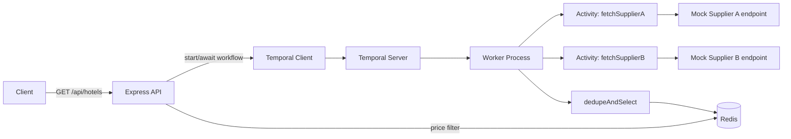

# Hotel Offer Orchestrator

A Node.js + TypeScript service that aggregates hotel listings from two mock suppliers,
deduplicates them by hotel name, selects the cheaper offer per hotel, caches the result
in Redis, and exposes a price-filterable API. Temporal.io orchestrates the comparison
logic so the workflow is durable, retryable, and resilient to a single supplier being down.

For the full design rationale (architecture, Redis schema, error-handling strategy,
scalability notes, and open assumptions), see [`DesignDocument.md`](./DesignDocument.md).

---

## Architecture at a glance



- **`api`** — Express app: `/api/hotels`, `/health`, and the two mock supplier endpoints
  (`/supplierA/hotels`, `/supplierB/hotels`).
- **`worker`** — Temporal worker running the `HotelAggregationWorkflow` and its activities.
- **`temporal`** — Temporal server (dev-mode, SQLite-backed for persistence across restarts).
- **`redis`** — caches deduped offers per city; price filtering happens via `ZRANGEBYSCORE`,
  not in application code.

---

## Prerequisites

- [Docker Desktop](https://www.docker.com/products/docker-desktop/) (includes Docker Compose v2)
- Node.js 20+ and npm — only needed if you want to run unit tests or `npm run dev` outside
  Docker; not required just to run the stack
- [Postman](https://www.postman.com/downloads/) — optional, for the manual API test collection

---

## Setup & run (Docker — recommended)

1. Clone the repository and move into it:
   ```bash
   git clone <repo-url>
   cd HotelOfferOrchestrator
   ```

2. Copy the example environment file (defaults already match the Docker Compose network,
   so no editing is required to run the stack as-is):
   ```bash
   cp .env.example .env
   ```

3. Build and start everything:
   ```bash
   docker compose up --build
   ```

4. Wait until all four containers report healthy. In another terminal:
   ```bash
   docker compose ps
   ```
   You should see `temporal`, `redis`, `api`, and `worker` all `running`/`healthy`.

5. Verify it's alive:
   ```bash
   curl http://localhost:3000/health
   curl "http://localhost:3000/api/hotels?city=delhi"
   ```

6. Shut everything down when you're done:
   ```bash
   docker compose down
   ```

### Running without Docker (local dev)

Only recommended if you already have Redis and a Temporal dev server running locally.

```bash
npm install
cp .env.example .env   # edit REDIS_URL / TEMPORAL_ADDRESS to point at localhost
npm run build
npm run start     # in one terminal: the API
npm run worker     # in another terminal: the Temporal worker
```

Or for iterative development: `npm run dev` runs the API with `tsx watch`.

---

## Environment variables

| Variable | Purpose | Docker default |
|---|---|---|
| `REDIS_URL` | Redis connection string | `redis://redis:6379` |
| `TEMPORAL_ADDRESS` | Temporal server address | `temporal:7233` |
| `SUPPLIER_A_URL` | Base URL the workflow calls for Supplier A | `http://api:3000/supplierA` |
| `SUPPLIER_B_URL` | Base URL the workflow calls for Supplier B | `http://api:3000/supplierB` |
| `PORT` | API listen port | `3000` |
| `CORS_ALLOWED_ORIGINS` | Comma-separated allow-list, never `*` | `http://localhost:3000` |
| `SIMULATE_SUPPLIER_DOWN` | `none` \| `a` \| `b` — forces a supplier outage. **Testing/demo only; not for production use.** | `none` |

---

## API reference

### `GET /api/hotels?city=<city>`
Returns the deduplicated, cheapest-price offer per hotel for the given city.

```json
[
  { "name": "Holtin", "price": 5340, "supplier": "Supplier B", "commissionPct": 20 },
  { "name": "Radison", "price": 5900, "supplier": "Supplier A", "commissionPct": 13 }
]
```

- `city` (required) — case-insensitive.
- `minPrice`, `maxPrice` (optional) — when either is supplied, the result is filtered
  via Redis's sorted set rather than the freshly-computed workflow result. Both must
  be non-negative numbers, and `minPrice` must not exceed `maxPrice`.
- Unknown city → `200` with `[]` (not an error condition).
- Missing city, non-numeric price, or inverted range → `400` with
  `{ "error": { "code": "...", "message": "..." } }`.
- Temporal/workflow unavailable → `503` with the same error shape.

### `GET /health`
Reports the status of both suppliers, Redis, and Temporal in parallel.

```json
{
  "status": "ok",
  "suppliers": {
    "supplierA": { "status": "up", "latencyMs": 12 },
    "supplierB": { "status": "up", "latencyMs": 9 }
  },
  "redis": { "status": "up", "latencyMs": 1 },
  "temporal": { "status": "up", "latencyMs": 4 }
}
```
`status` is `"ok"` when everything is healthy, `"degraded"` when a supplier is down but
Redis/Temporal are fine, and `"down"` when Redis or Temporal itself is unreachable.

### `GET /supplierA/hotels?city=<city>` / `GET /supplierB/hotels?city=<city>`
Static seeded mock supplier data. Pass `?simulateDown=true` to force that single request
to return a `5xx`, useful for testing outage handling without restarting anything.

---

## Simulating a supplier outage

There are two independent ways to simulate Supplier A (or B) being down:

**1. Per-request, via the mock endpoint directly** — works immediately, no restart needed:
```bash
curl "http://localhost:3000/supplierA/hotels?simulateDown=true"
```
This only affects that one call; it does not change what `/api/hotels` returns, since the
workflow's own calls to the supplier don't pass this flag.

**2. For the whole stack**, so `/api/hotels` and `/health` genuinely degrade — restart the
`api` and `worker` containers with the outage override:
```bash
docker compose down
docker compose -f docker-compose.yml -f docker-compose.outage.yml up -d --build
```
This sets `SIMULATE_SUPPLIER_DOWN=a` on both containers. With this running:
- `GET /api/hotels?city=delhi` returns `200` with only Supplier B's hotels.
- `GET /health` reports `"status": "degraded"` and `supplierA.status: "down"`.

Restore normal operation afterward:
```bash
docker compose down
docker compose -f docker-compose.yml up -d --build
```

---

## Running the tests

### Unit tests
No Docker required — runs the dedupe logic, Redis helpers (via `ioredis-mock`), the
Temporal workflow (via `@temporalio/testing`), and all route/validation tests:
```bash
npm test
```

### Integration tests
Requires the Docker stack to already be running (`docker compose up -d --build`):
```bash
npm run test:integration
```
This hits the live API with supertest. The outage-specific test is skipped unless the
stack is running with `SIMULATE_SUPPLIER_DOWN=a` set (see above) — it checks
`process.env.SIMULATE_SUPPLIER_DOWN` at run time and self-skips otherwise, so it's safe
to run in either mode without manual intervention.

### Postman collection
1. Import [`postman/hotel-orchestrator.postman_collection.json`](./postman/hotel-orchestrator.postman_collection.json)
   into Postman.
2. With the stack running normally, run the **Happy path**, **No results**,
   **Validation errors**, and **Health check** folders directly.
3. For the **Supplier outage simulation** folder, first apply the outage override
   (see above), run the folder, then restore normal operation. See
   [`postman/README.md`](./postman/README.md) for the exact commands and per-request notes.
4. Optional CI execution via Newman:
   ```bash
   npx newman run postman/hotel-orchestrator.postman_collection.json
   ```

---

## Design notes & assumptions

These are called out here per the project's own tracking; see `DesignDocument.md` §14
for the full rationale.

- **Tie-break rule:** when both suppliers list a hotel at the identical price, the offer
  with the lower `commissionPct` wins; if that's also tied, Supplier A is preferred.
- **Cache TTL:** Redis-cached offers expire after 300 seconds by default (configurable via
  `REDIS_CACHE_TTL_SECONDS`), balancing freshness against re-running the workflow on every
  request.
- **Concurrent requests for the same city** share one Temporal workflow, keyed by a
  deterministic `workflowId` derived from the city name, rather than each triggering a
  fresh workflow run.
- **Temporal server setup:** the `temporal` service in `docker-compose.yml` overrides the
  `temporalio/auto-setup` image's entrypoint to use the bundled `temporal` CLI's
  `server start-dev` command with SQLite persistence, since the auto-setup wrapper in the
  pinned image version doesn't support SQLite directly. This relies on that image also
  shipping the CLI binary — see the inline comment in `docker-compose.yml` for details, and
  re-verify this if the pinned Temporal image version is upgraded.

---

## Known limitations / future extensions

- **Pagination** is not implemented; large hotel catalogs would need it for `/api/hotels`.
- **A supplier-adapter interface** would make adding a third supplier a matter of
  implementing one interface, rather than touching the workflow directly.
- **Auth/user management** is out of scope for this assessment.
- **`SIMULATE_SUPPLIER_DOWN`** exists purely to support integration tests and demos; it
  should never be set in a production deployment.